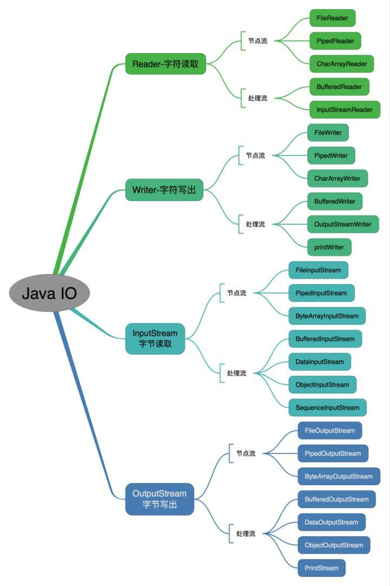
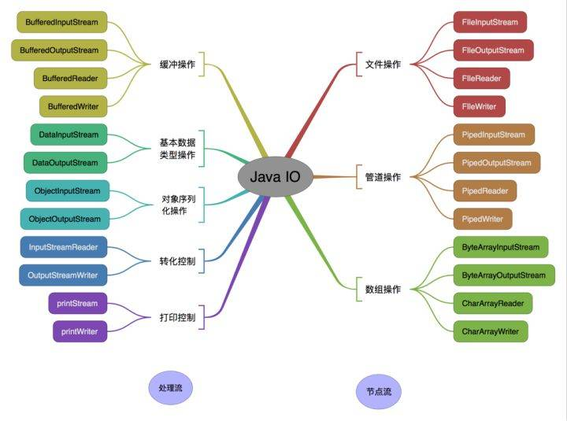
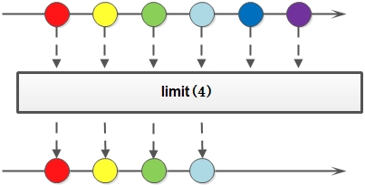

# java-convert-example

> 平时的java项目中会存在各种对象的互相转换的情况，本项目记录一些常见对象转换的方法，例如：文件转换、日期时间转换、stream流转换、集合对象转换等

## 文件

Java 为文件操作设计了很多的类，有数据相关的 IO Stream 流，与文件相关的File、Path等对文件系统的抽象。  
Java 的 io 包和几乎包含了所有操作输入、输出需要的类，另外 java1.4 开始推出的 nio 接口能更高效的完成一些工作。  
Java io 包中的流支持很多种格式，比如：基本类型、对象、本地化字符集等等。所有这些流类代表了输入源和输出目标。  
一个流可以理解为一个数据的序列。输入流表示从一个源读取数据，输出流表示向一个目标写数据。  

### IO

#### IO 流分类：

- 按照流的流向分，可以分为输入流和输出流；
- 按照操作单元划分，可以划分为字节流和字符流；
- 按照流的角色划分为节点流和处理流。

按照操作方式分类：



按照操作对象分类：



#### IO 流基础对象：

- InputStream/Reader: 所有的输入流的基类，前者是字节输入流，后者是字符输入流。
- OutputStream/Writer: 所有输出流的基类，前者是字节输出流，后者是字符输出流。

### NIO

java 1.4 版本后，重新设计出了一套新的 IO 接口：Non-blocking IO(NIO)

#### NIO 与 IO 的区别：

1. IO是面向流的，NIO是面向缓冲区的；
2. IO流是阻塞的，NIO流是不阻塞的;
3. NIO有选择器，而IO没有。

#### 读写数据方式：

- 从通道进行数据读取 ：创建一个缓冲区，然后请求通道读取数据。
- 从通道进行数据写入 ：创建一个缓冲区，填充数据，并要求通道写入数据。

### 文件

java 文件操作的基础是 File/Path, 一个代表文件，一个代表路径，两者组合完整地描述各种操作系统中的文件，尤其适合 Linux 的 
'Everything is a File' 的哲学。

### String -> File （Write File）

#### 使用 NIO 的 Files **(推荐)**

由于 Files 是 nio 在 java7 新增的内容，使用本方法需要首先将程序的 jdk 升级到 jdk7+; Files 工具类提供了各种读写创建删除文件等操作，可以很方便的操作文件和流。

1. 如果写入的是字符数据，则需要设置字符编码 Charset
2. 如果写入的是字节数据（byte[]），不需要设置字符编码
3. 如果想在已存在的文件后追加内容，可以增加 java.nio.file.StandardOpenOption#APPEND 参数

DEMO 参考： [String2FileWithJavaNioExample](https://github.com/zzycreate/java-convert-example/blob/master/src/main/java/io/github/zzycreate/example/file/string2file/String2FileWithJavaNioExample.java)

```
    List<String> lines = Arrays.asList("The second line", "The second line");
    Path path = Paths.get("filename.txt");
    try {
        Files.write(path, lines, StandardCharsets.UTF_8);
    } catch (IOException e) {
        e.printStackTrace();
    }
```

#### 使用 NIO 的 Channel

标准的IO编程接口是面向字节流和字符流的。而NIO是面向通道和缓冲区的，数据总是从通道中读到buffer缓冲区内，或者从buffer写入到通道中。

Java NIO 的 Channel 和 IO 流的对比：

1. 通道可以读也可以写，流一般来说是单向的（只能读或者写）。
2. 通道可以异步读写。
3. 通道总是基于缓冲区Buffer来读写。

DEMO 参考： [String2FileWithJavaNioExample](https://github.com/zzycreate/java-convert-example/blob/master/src/main/java/io/github/zzycreate/example/file/string2file/String2FileWithJavaNioExample.java)


使用 FileOutputStream 的 FileChannel：

```
    String data = "The second line" + System.getProperty("line.separator") + 
                          "The second line" + System.getProperty("line.separator");
    // use ByteBuffer wrap data
    final ByteBuffer buffer = ByteBuffer.wrap(data.getBytes());
    // try-with-resources auto close the channel
    try (// open channel
        final FileOutputStream fos = new FileOutputStream(new File("filename.txt"));
        FileChannel channel = fos.getChannel()) {
        // write buffer to channel
        while (buffer.hasRemaining()) {
            channel.write(buffer);
        }

    } catch (IOException e) {
        e.printStackTrace();
    }
```

使用 RandomAccessFile 的 FileChannel：

```
    String data = "The second line" + System.getProperty("line.separator") + 
                          "The second line" + System.getProperty("line.separator");
    final ByteBuffer buffer = ByteBuffer.wrap(data.getBytes());
    try(final RandomAccessFile file = new RandomAccessFile("filename.txt", "rw");
        FileChannel channel = file.getChannel()){
        
        while (buffer.hasRemaining()){
            channel.write(buffer);
        }

    } catch (IOException e) {
        e.printStackTrace();
    }
```

#### 使用 BufferedWriter **(推荐)**

1. BufferedWriter 可以设置缓存区大小
2. OutputStreamWriter 可以指定字符集编码   
3. FileOutputStream 可以指定文件编辑模式(追加/覆盖)

使用 PrintWriter/FileWriter 一般写入的内容比较少，如果需要写入大量数据，应该要使用缓冲流，提高效率。

DEMO 参考： [String2FileWithWriterExample](https://github.com/zzycreate/java-convert-example/blob/master/src/main/java/io/github/zzycreate/example/file/string2file/String2FileWithWriterExample.java)

```
    try (Writer writer = new BufferedWriter(new OutputStreamWriter(
            new FileOutputStream("filename.txt", true), StandardCharsets.UTF_8))) {
        writer.write("The second line" + System.getProperty("line.separator") + 
        "The second line" + System.getProperty("line.separator"));
    } catch (IOException e) {
        e.printStackTrace();
    }
```

#### 使用 PrintWrite

使用PrintWrite可以很简单的使用println进行单行输入，但是存在的文件会被截断

1. 如果文件已经存在，PrintWriter 会将文件大小截断为零，如果不想截断文件，可以使用FileWriter作为替代，FileWriter设置字符大小和缓冲大小。
2. 使用 PrintWriter 不需要输入文件 path，所以创建文件的路径需要看执行程序时的工作目录。
3. PriteWriter 会导致吞异常，见 [stackoverflow.com/a/1747092/4678667](https://stackoverflow.com/questions/1747040/difference-between-java-io-printwriter-and-java-io-bufferedwriter/1747092#1747092) 。

DEMO 参考： [String2FileWithWriterExample](https://github.com/zzycreate/java-convert-example/blob/master/src/main/java/io/github/zzycreate/example/file/string2file/String2FileWithWriterExample.java)

```
    try (PrintWriter writer = new PrintWriter("filename.txt", "UTF-8")) {
        writer.println("The first line");
        writer.println("The second line");
    } catch (FileNotFoundException | UnsupportedEncodingException e) {
        e.printStackTrace();
    }
```

#### 使用 FileWriter

FileWriter 在创建的时候可以指定追加/覆盖模式，避免 PrintWriter 截断已存在的文件。

DEMO 参考： [String2FileWithWriterExample](https://github.com/zzycreate/java-convert-example/blob/master/src/main/java/io/github/zzycreate/example/file/string2file/String2FileWithWriterExample.java)

```
    try (FileWriter writer = new FileWriter(new File("filename.txt"), true)) {
        writer.append("The first line").append(System.getProperty("line.separator"))
                .append(LINE2).append(System.getProperty("line.separator"));
    } catch (IOException e) {
        e.printStackTrace();
    }
```

#### 使用 commons-io 的 FileUtils

Commons-io 项目地址： [apache/commons-io](https://commons.apache.org/proper/commons-io/)  
使用 commons-io 包中的 FileUtils 进行文件写入, 重构的方法可以设置文件编码和写入模式

DEMO 参考： [String2FileWithCommonsExample](https://github.com/zzycreate/java-convert-example/blob/master/src/main/java/io/github/zzycreate/example/file/string2file/String2FileWithCommonsExample.java)

```
    try {
        String data = "The second line" + System.getProperty("line.separator") + 
                              "The second line" + System.getProperty("line.separator");
        FileUtils.writeStringToFile(new File("filename.txt"), data, StandardCharsets.UTF_8, true);
    } catch (IOException e) {
        e.printStackTrace();
    }
```

#### 使用 guava 的 Files

Guava 的官方开源项目地址： [google/guava](https://github.com/google/guava)  
guava 的 Files 可以直接向文件中写入 byte[] 数据  
Files 已被标注为 @Beta 不稳定的版本，并提示使用 jdk7 nio 的 Files、MoreFiles 等工具类利用 nio 的 Path 进行文件处理  

DEMO 参考： [String2FileWithGuavaExample](https://github.com/zzycreate/java-convert-example/blob/master/src/main/java/io/github/zzycreate/example/file/string2file/String2FileWithGuavaExample.java)

```
    try {
        String data = "The second line" + System.getProperty("line.separator") + 
                          "The second line" + System.getProperty("line.separator");
        Files.write(data.getBytes(), new File("filename.txt"));
    } catch (IOException e) {
        e.printStackTrace();
    }
```

#### 使用 guava 的 CharSink/ByteSink

guava 的 CharSink 可以直接向文件中写入字符数据，ByteSink 则可以写入字节数据  
Files 中的 write、append、copy 等方法本质上都是调用的这些 Sink 类。    

DEMO 参考： [String2FileWithGuavaExample](https://github.com/zzycreate/java-convert-example/blob/master/src/main/java/io/github/zzycreate/example/file/string2file/String2FileWithGuavaExample.java)

```
    try {
        String data = "The second line" + System.getProperty("line.separator") + 
                          "The second line" + System.getProperty("line.separator");
       Files.asCharSink(new File("filename.txt"), StandardCharsets.UTF_8, FileWriteMode.APPEND).write(data);
    } catch (IOException e) {
        e.printStackTrace();
    }
```

### File -> String (Read File)

#### 使用 NIO 的 Files **(推荐)**

NIO 的 Files 工具类提供多种 read 方法可以快速进行文件读取

DEMO 参考： [File2StringWithNioExample](https://github.com/zzycreate/java-convert-example/blob/master/src/main/java/io/github/zzycreate/example/file/file2string/File2StringWithNioExample.java)

使用 readAllBytes 读取字节：

```
    try {
        return new String(Files.readAllBytes(Paths.get("filename.txt")));
    } catch (IOException e) {
        e.printStackTrace();
    }
```

使用 readAllLines 逐行读取字符串：

```
    try {
        List<String> lines = Files.readAllLines(Paths.get("filename.txt"), StandardCharsets.UTF_8);
        StringBuilder sb = new StringBuilder();
        lines.forEach(s -> sb.append(s).append(SEPARATOR));
        return sb.toString();
    } catch (IOException e) {
        e.printStackTrace();
    }
    return null;
```

由于 Stream 内部无法在 lambda 中使用带有 checked Exception 的方法，因此要对异常的抓取，防止发生异常  

使用 lines 逐行读取字符串：

```
    try (Stream<String> lines = Files.lines(Paths.get("filename.txt"), StandardCharsets.UTF_8)) {
        StringBuilder content = new StringBuilder();
        lines.forEach(s -> content.append(s).append(SEPARATOR));
        return content.toString();
    } catch (IOException e) {
        e.printStackTrace();
    }
```

#### 使用 Scanner 

Scanner 默认的缓冲大小为 1024, 可以读取文件，但是读取空文件的时候会出现异常，见 [Scanner的讨论](https://stackoverflow
.com/questions/326390/how-do-i-create-a-java-string-from-the-contents-of-a-file)  
Scanner 使用正则表达式 `\A.` 匹配开始节点。 

DEMO 参考： [File2StringWithScannerExample](https://github.com/zzycreate/java-convert-example/blob/master/src/main/java/io/github/zzycreate/example/file/file2string/File2StringWithScannerExample.java)


```
    try (Scanner scanner = new Scanner(new File("filename.txt"), "UTF-8")) {
        return scanner.useDelimiter("\\A").next();
    } catch (FileNotFoundException e) {
        e.printStackTrace();
    }
```

#### 使用 BufferedReader **(推荐)**

BufferedReader 缓冲流，可以高效的读取文件，使用 Reader 和 InputStream 组合可以设置各种配置。  
1. 使用 InputStreamReader 可以设置字符集
2. 使用 FileInputStream 可以读取文件
3. 或者使用 FileReader 直接读取文件，并用 BufferedReader 包装成缓存使用

DEMO 参考： [File2StringWithReaderExample](https://github.com/zzycreate/java-convert-example/blob/master/src/main/java/io/github/zzycreate/example/file/file2string/File2StringWithReaderExample.java)

```
    // new BufferedReader(new FileReader("filename.txt"));
    try (BufferedReader reader = new BufferedReader(new InputStreamReader(new FileInputStream("filename.txt"), StandardCharsets.UTF_8))) {
        String line;
        StringBuilder stringBuilder = new StringBuilder();
        while ((line = reader.readLine()) != null) {
            stringBuilder.append(line).append(SEPARATOR);
        }
        return stringBuilder.toString();
    } catch (IOException e) {
        e.printStackTrace();
    }
```

使用 BufferReader 的 lines 方法逐行读取数据：

```
    try (BufferedReader reader = new BufferedReader(new FileReader("filename.txt"))) {
        return reader.lines().collect(Collectors.joining(System.getProperty("line.separator"));
    } catch (IOException e) {
        e.printStackTrace();
    }
```

#### 使用 FileInputStream

仅仅使用 FileInputStream 进行文件读取，从 FileInputStream 写入 byte[] 缓存，转换为文本数据，这段代码只需要 jdk1.0+

DEMO 参考： [File2StringWithReaderExample](https://github.com/zzycreate/java-convert-example/blob/master/src/main/java/io/github/zzycreate/example/file/file2string/File2StringWithReaderExample.java)

```
    FileInputStream fis = null;
    try {
        fis = new FileInputStream("filename.txt");
        byte[] buffer = new byte[fis.available()];
        int length = fis.read(buffer);
        return new String(buffer, 0, length, StandardCharsets.UTF_8);
    } catch (IOException e) {
        e.printStackTrace();
    } finally {
        if (fis != null) {
            try {
                fis.close();
            } catch (IOException e) {
                e.printStackTrace();
            }
        }
    }
    return null;
```

#### 使用 commons-io 的 IOUtils

commons-io 的 IOUtils 工具类提供了大量 IO 相关的工具方法，使用 IOUtils.copy 直接将 Reader/InputStream 转换为 Writer/OutputStream  

DEMO 参考： [File2StringWithCommonsExample](https://github.com/zzycreate/java-convert-example/blob/master/src/main/java/io/github/zzycreate/example/file/file2string/File2StringWithCommonsExample.java)

使用 FileReader 读取文件，使用 StringWriter 将流中的内容输出出来:

```
    try (FileReader fileReader = new FileReader("filename.txt");
         StringWriter stringWriter = new StringWriter()) {
        IOUtils.copy(fileReader, stringWriter);
        return stringWriter.toString();
    } catch (IOException e) {
        e.printStackTrace();
    }
```

#### 使用 commons-io 的 FileUtils

commons-io 的 FileUtils 提供了文件相关的工具方法， 使用 FileUtils.readByFileUtilsReadFileToString 读取文件内容

DEMO 参考： [File2StringWithCommonsExample](https://github.com/zzycreate/java-convert-example/blob/master/src/main/java/io/github/zzycreate/example/file/file2string/File2StringWithCommonsExample.java)

```
    try {
        return FileUtils.readFileToString(new File("filename.txt"), StandardCharsets.UTF_8);
    } catch (IOException e) {
        e.printStackTrace();
    }
```

#### 使用 guava 的 Files

直接使用 guava 的 Files 转换为 ByteSource/CharSource 然后直接 read 成字符串:

```
    try {
        // Resources.asCharSource(new URL(""), StandardCharsets.UTF_8).read();
        return Files.asCharSource(new File("filename.txt"), StandardCharsets.UTF_8).read();
    } catch (IOException e) {
        e.printStackTrace();
    }
```

或者使用 readLines 逐行读取：

```
    try {
        return String.join(System.getProperty("line.separator"), Files.readLines(new File("filename.txt"), StandardCharsets.UTF_8));
    } catch (IOException e) {
        e.printStackTrace();
    }
```

### File -> File (copy File)

#### 使用 NIO 的 Channel

标准的IO编程接口是面向字节流和字符流的。而NIO是面向通道和缓冲区的，数据总是从通道中读到buffer缓冲区内，或者从buffer写入到通道中。

Java NIO 的 Channel 和 IO 流的对比：

1. 通道可以读也可以写，流一般来说是单向的（只能读或者写）。
2. 通道可以异步读写。
3. 通道总是基于缓冲区Buffer来读写。

Buffer 及其子类不是线程安全的

Buffer 的属性：

1. capacity - 缓存容量
2. limit - 缓存下表限制值
3. position - 当前操作的下标值
4. mark - 临时下标值

几个属性的关系： 0 <= mark <= position <= limit <= capacity

Buffer 的方法：

1. mark(): mark 设置成 position
3. clear(): mark 设置为 -1 清除标记, position 设置为 0, limit 设置为 capacity, **数据写入 Buffer 前调用**, 或者说是 Channel 读取之前调用
4. flip(): limit 设置成 position 当前位置作为上限, position 设置为 0, **Buffer 读取数据前调用**，或者说是 Channel 写入之前调用
5. rewind(): position 设置为 0, limit 不变, **数据重新写入 Buffer 前调用**

使用不同的 Channel 同时操作同一个 Buffer 可以实现文件的复制。

DEMO 参考： [File2FileWithNioExample](https://github.com/zzycreate/java-convert-example/blob/master/src/main/java/io/github/zzycreate/example/file/file2file/File2FileWithNioExample.java)


```
    try (FileInputStream input = new FileInputStream("filename.txt");
         FileOutputStream output = new FileOutputStream("filename.txt");
         ReadableByteChannel from = input.getChannel();
         WritableByteChannel to = output.getChannel()) {
        ByteBuffer buffer = ByteBuffer.allocateDirect(16 * 1024);
        while (from.read(buffer) != -1) {
            // Prepare the buffer to be drained
            buffer.flip();

            // Make sure that the buffer was fully drained
            while (buffer.hasRemaining()) {
                to.write(buffer);
            }

            // Make the buffer empty, ready for filling
            buffer.clear();
        }
    } catch (IOException e) {
        e.printStackTrace();
    }
```

## 日期时间

### java 的时间操作 API

#### java.util 包的时间操作

`jdk 1.1` 就开始提供了基础的日期时间相关的功能，`java.util.Date`、`java.util.Calendar`、`java.text.DateFormat`、`java.sql.Date`、`java.sql.Time`、
`java.sql.Timestamp` 等是 `jdk 1.1` 中常用的日期时间类，`java.util.Date` 代表了时间，`java.util.Calendar` 代表了日期，`java.text.DateFormat` 
用于格式化时间，`java.sql.Date` 是 `java.util.Date` 的包装类，代表了数据库中的 DATE，`java.sql.Time` 代表数据库的时间（不含日期）, `java.sql.Timestamp` 代表了数据库的 TIMESTAMP。

SimpleDateFormat 时间格式化常用字符及含义：

| 字母	| 含义	| 示例    |
| ---   | ---   | ---   |
| G | 纪元 | 在 Locale.CHINA语言环境下，如 '公元';<br/>在Locale.US语言环境下，如 'AD' |
| y	| 年份。一般用 yy 表示两位年份，yyyy 表示 4 位年份	| 使用 yy 表示的年扮，如 11；<br/>使用 yyyy 表示的年份，如 2011 | 
| M	| 月份。一般用 MM 表示月份，如果使用 MMM，则会根据语言环境显示不同语言的月份	| 使用 MM 表示的月份，如 05；<br/>使用 MMM 表示月份，在 Locale.CHINA语言环境下，如“十月”；<br/>在Locale.US语言环境下，如 Oct | 
| d	| 月份中的天数。一般用 dd 表示天数	| 使用 dd 表示的天数，如 10 |
| D	| 年份中的天数。表示当天是当年的第几天， 用 D 表示	| 使用 D 表示的年份中的天数，如 295 |
| E	| 星期几。用 E 表示，会根据语言环境的不同， 显示不同语言的星期几	| 使用 E 表示星期几，<br/>在 Locale.CHINA 语言环境下，如“星期四”；<br/>在 Locale.US 语言环境下，如 Thu |
| H	| 一天中的小时数（0~23)。一般用 HH 表示小时数	| 使用 HH 表示的小时数，如 18 |
| h	| 一天中的小时数（1~12)。一般使用hh表 示小时数	| 使用 hh 表示的小时数，如 10 (注意 10 有可能是 10 点，也可能是 22 点）
| m	| 分钟数。一般使用 mm 表示分钟数	| 使用 mm 表示的分钟数，如 29 |
| s	| 秒数。一般使用 ss 表示秒数	| 使用 ss 表示的秒数，如 38 |
| S	| 毫秒数。一般使用 SSS 表示毫秒数	| 使用 SSS 表示的毫秒数，如 156 |

`Date` 代表了一个特定的时间，可以精确到毫秒，也能表示年月日等日期概念。

但 util 中的日期时间操作存在一些问题：

1. Java的日期/时间类的定义并不一致，在java.util和java.sql的包中都有日期类，此外用于格式化和解析的类在java.text包中定义。
2. java.util.Date同时包含日期和时间，而java.sql.Date仅包含日期，将其纳入java.sql包并不合理。另外这两个类都有相同的名字，这本身就是一个非常糟糕的设计。
3. 对于时间、时间戳、格式化以及解析，并没有一些明确定义的类。对于格式化和解析的需求，我们有java.text.DateFormat抽象类，但通常情况下，SimpleDateFormat类被用于此类需求。
4. 所有的日期类都是可变的，因此他们都不是线程安全的，这是Java日期类最大的问题之一。
5. 日期类并不提供国际化，没有时区支持，因此Java引入了java.util.Calendar和java.util.TimeZone类，但他们同样存在上述所有的问题。

#### java.time 包的时间操作

Java 8 新增的日期时间 API 遵循 JSR 310 设计规范，解决上述 API 中的缺陷。

主要的操作对象有：

1. java.time.LocalTime: 时间
2. java.time.LocalDate: 日期
3. java.time.LocalDateTime: 日期/时间
4. java.time.ZoneId: 时区
5. java.time.ZoneOffset: 时区偏移量
6. java.time.ZonedDateTime: 带时区信息的日期/时间
7. java.time.Instant: 时刻（时间戳）
8. java.time.Duration java.time.Period: 时间段

这些对象都是线程安全，且不可变，API 方法设计简单，转换容易，配合 `java.time.format.DateTimeFormatter` 可以很容易的进行格式化。

以上这些对象的关联关系：

1. LocalDateTime = LocalDate + LocalTime
2. ZonedDateTime = LocalDateTime + ZoneId/ZoneOffset
3. Instant = seconds + nano

Java 8日期/时间API是JSR-310的实现，它的实现目标是克服旧的日期时间实现中所有的缺陷，新的日期/时间API的一些设计原则是：

1. 不变性：新的日期/时间API中，所有的类都是不可变的，这对多线程环境有好处。
2. 关注点分离：新的API将人可读的日期时间和机器时间（unix timestamp）明确分离，它为日期（Date）、时间（Time）、日期时间（DateTime）、时间戳（unix timestamp）以及时区定义了不同的类。
3. 清晰：在所有的类中，方法都被明确定义用以完成相同的行为。举个例子，要拿到当前实例我们可以使用now()方法，在所有的类中都定义了format()和parse()
方法，而不是像以前那样专门有一个独立的类。为了更好的处理问题，所有的类都使用了工厂模式和策略模式，一旦你使用了其中某个类的方法，与其他类协同工作并不困难。
4. 实用操作：所有新的日期/时间API类都实现了一系列方法用以完成通用的任务，如：加、减、格式化、解析、从日期/时间中提取单独部分，等等。
5. 可扩展性：新的日期/时间API是工作在ISO-8601日历系统上的，但我们也可以将其应用在非IOS的日历上。


### java 1.1 日期/时间操作

#### 对象构造

示例代码： [Jdk1DateExample.java](https://github.com/zzycreate/java-convert-example/blob/master/src/main/java/io/github/zzycreate/example/datetime/Jdk1DateExample.java)


```
    // 毫秒值
    long timestamp = System.currentTimeMillis();

    // java.util.Date 除了一下两种构造方法，其他构造方法均已过期
    Date date = new Date();
    Date date1 = new Date(timestamp);

    // sql date/time/timestamp 是针对SQL语言使用的，Date只有日期而没有时间，Time只有时间而没有日期
    java.sql.Date sqlDate = new java.sql.Date(timestamp);
    java.sql.Date sqlDate1 = new java.sql.Date(date1.getTime());
    java.sql.Time sqlTime = new java.sql.Time(timestamp);
    java.sql.Time sqlTime1 = new java.sql.Time(date1.getTime());
    java.sql.Timestamp sqlTimestamp = new java.sql.Timestamp(timestamp);
    java.sql.Timestamp sqlTimestamp1 = new java.sql.Timestamp(date1.getTime());

    // Calendar 代表日历, GregorianCalendar 代表公历
    Calendar calendar = Calendar.getInstance();
    GregorianCalendar gregorianCalendar = new GregorianCalendar();
```

#### 对象取值

示例代码： [Jdk1DateExample.java](https://github.com/zzycreate/java-convert-example/blob/master/src/main/java/io/github/zzycreate/example/datetime/Jdk1DateExample.java)

```
    long timestamp = System.currentTimeMillis();
    Date date = new Date(timestamp);
    java.sql.Date sqlDate = new java.sql.Date(timestamp);
    java.sql.Time sqlTime = new java.sql.Time(timestamp);
    java.sql.Timestamp sqlTimestamp = new java.sql.Timestamp(timestamp);
    Calendar calendar = Calendar.getInstance();
    GregorianCalendar gregorianCalendar = new GregorianCalendar();

    // Date 除了 getTime() 方法可以获取时间戳毫秒值外，其他 get 方法在 jdk8 中均已过期，不推荐时间
    // sql date/time/timestamp 均为 util date 的子类，过期方法类似
    long s = date.getTime();
    long sqlTimes = sqlDate.getTime();
    long sqlTime1 = sqlTime.getTime();
    long sqlTime2 = sqlTimestamp.getTime();
    long sqlNano1 = sqlTimestamp.getNanos();
    long sqlNano2 = sqlTimestamp.getNanos();

    Date calendarTime = calendar.getTime();
    int year = calendar.get(Calendar.YEAR);
    // 由于月份是从0开始，一般 +1 之后才和人的主观感受一直
    int month = calendar.get(Calendar.MONTH) + 1;
    int dateNum = calendar.get(Calendar.DATE);
    int hour = calendar.get(Calendar.HOUR_OF_DAY);
    int minute = calendar.get(Calendar.MINUTE);
    int second = calendar.get(Calendar.SECOND);
    // 星期
    int dayOfWeek = calendar.get(Calendar.DAY_OF_WEEK);
    // 日期
    int dayOfMonth = calendar.get(Calendar.DAY_OF_MONTH);

    boolean isLeapYear = gregorianCalendar.isLeapYear(year);
```

### java 8 日期/时间操作

JSR 303 的日期时间对象虽然多，但是操作的 API 基本类似，很容易理解，以下距离没有列举所有情况，但其他操作基本类似。

#### 对象构造

对象的创建基本都是 now (当前时间)、of (静态构造方法)、parse (文本解析)、at (维度组合)、to (对象转换)、between (区间) 等简单明了的 API。

示例代码： [Jdk8TimeExample.java](https://github.com/zzycreate/java-convert-example/blob/master/src/main/java/io/github/zzycreate/example/datetime/Jdk8TimeExample.java)

```
    LocalTime time = LocalTime.now();
    LocalTime time1 = LocalTime.of(13, 14, 15);
    LocalTime time2 = LocalTime.ofSecondOfDay(47655);
    LocalTime time3 = LocalTime.parse("13:14:15");

    LocalDate date = LocalDate.now();
    LocalDate date1 = LocalDate.of(2019, 5, 10);
    LocalDate date2 = LocalDate.ofYearDay(2019, 130);
    LocalDate date3 = LocalDate.parse("2019-05-10");

    LocalDateTime dateTime = LocalDateTime.now();
    LocalDateTime dateTime1 = LocalDateTime.of(2019, 5, 10, 13, 14, 15);
    LocalDateTime dateTime2 = LocalDateTime.of(date, time);
    LocalDateTime dateTime3 = date.atStartOfDay();
    LocalDateTime dateTime4 = date.atTime(time);
    LocalDateTime dateTime5 = date.atTime(13, 14, 15);
    LocalDateTime dateTime6 = time.atDate(date);

    ZonedDateTime zonedDateTime = ZonedDateTime.now();
    ZonedDateTime zonedDateTime1 = dateTime.atZone(ZoneId.systemDefault());
    ZonedDateTime zonedDateTime2 = dateTime.atZone(ZoneId.of("Asia/Shanghai"));

    LocalDateTime dateTime7 = zonedDateTime.toLocalDateTime();
    LocalDate date4 = zonedDateTime.toLocalDate();
    LocalTime time4 = zonedDateTime.toLocalTime();

    Instant instant = dateTime.toInstant(ZoneOffset.of("+08:00"));
    Instant instant1 = zonedDateTime.toInstant();
    Instant instant2 = new Date().toInstant();

    Duration duration = Duration.between(time, time1);
    Period period = Period.between(date, date1);

```

#### 对象取值和比较

对象的 get 方法可以获取对象结构的组成部分，is方法可以用做时间的简单判断。

示例代码： [Jdk8TimeExample.java](https://github.com/zzycreate/java-convert-example/blob/master/src/main/java/io/github/zzycreate/example/datetime/Jdk8TimeExample.java)

```
    ZonedDateTime zonedDateTime = ZonedDateTime.now();
    LocalDateTime dateTime = zonedDateTime.toLocalDateTime();
    LocalDate date = dateTime.toLocalDate();
    LocalTime time = dateTime.toLocalTime();

    int year = date.getYear();
    Month month = date.getMonth();
    int monthValue = date.getMonthValue();
    int dayOfYear = date.getDayOfYear();
    int dayOfMonth = date.getDayOfMonth();
    DayOfWeek dayOfWeek = date.getDayOfWeek();

    int hour = time.getHour();
    int minute = time.getMinute();
    int second = time.getSecond();
    int nano = time.getNano();

    ZoneId zone = zonedDateTime.getZone();
    ZoneOffset offset = zonedDateTime.getOffset();

    LocalDateTime now = LocalDateTime.now();

    System.out.println(String.format("dateTime is before now: %s", dateTime.isBefore(now)));
    System.out.println(String.format("dateTime is before now: %s", dateTime.isAfter(now)));
    System.out.println(String.format("date is leap year(闰年): %s", dateTime.toLocalDate().isLeapYear()));
```

### 类型转换

> 以下为 jdk 1.1 时间日期与 jdk1.8 时间日期的转换

#### Date -> Instant

示例代码： [DateLocalDateTimeConvertExample.java](https://github.com/zzycreate/java-convert-example/blob/master/src/main/java/io/github/zzycreate/example/datetime/DateLocalDateTimeConvertExample.java)

```
    Instant instant = new Date().toInstant();
    Instant instant1 = Instant.ofEpochMilli(new Date().getTime())
```

#### Date -> LocalDateTime/LocalDate/LocalTime

示例代码： [DateLocalDateTimeConvertExample.java](https://github.com/zzycreate/java-convert-example/blob/master/src/main/java/io/github/zzycreate/example/datetime/DateLocalDateTimeConvertExample.java)

```
    LocalDateTime localDateTime = LocalDateTime.ofInstant(new Date().toInstant(), ZoneId.systemDefault());
    LocalDate localDate = LocalDateTime.ofInstant(new Date().toInstant(), ZoneId.systemDefault()).toLocalDate();
    LocalTime localTime = LocalDateTime.ofInstant(new Date().toInstant(), ZoneId.systemDefault()).toLocalTime();
```

#### Instant -> Date

示例代码： [DateLocalDateTimeConvertExample.java](https://github.com/zzycreate/java-convert-example/blob/master/src/main/java/io/github/zzycreate/example/datetime/DateLocalDateTimeConvertExample.java)

```
    Date date = new Date(Instant.now().toEpochMilli());
```

#### LocalDateTime -> Date

示例代码： [DateLocalDateTimeConvertExample.java](https://github.com/zzycreate/java-convert-example/blob/master/src/main/java/io/github/zzycreate/example/datetime/DateLocalDateTimeConvertExample.java)

```
    Date date = new Date(LocalDateTime.now().toInstant(ZoneOffset.of("+08:00")).toEpochMilli());
```

> 以下为字符串与时间日期的转换

#### String -> Date

示例代码： [DateTimeStringExample.java](https://github.com/zzycreate/java-convert-example/blob/master/src/main/java/io/github/zzycreate/example/datetime/DateTimeStringExample.java)

使用 `SimpleDateFormat` 按照格式解析字符串，可能会出现异常，格式见前文表格。

```
    try {
        SimpleDateFormat sdf = new SimpleDateFormat("yyyy-MM-dd HH:mm:ss");
        Date date = sdf.parse("2019-01-02 15:23:46");
    } catch (ParseException e) {
        e.printStackTrace();
    }
```

或者间接利用 LocalDateTime 进行字符串解析

```
    DateTimeFormatter dateTimeFormatter = DateTimeFormatter.ofPattern("yyyy-MM-dd HH:mm:ss");
    LocalDateTime localDateTime = LocalDateTime.parse("2019-05-10 13:14:15", dateTimeFormatter);
    Date date = Date.from(localDateTime.toInstant(ZoneOffset.of("+08:00")));
```

#### String -> LocalDateTime

示例代码： [DateTimeStringExample.java](https://github.com/zzycreate/java-convert-example/blob/master/src/main/java/io/github/zzycreate/example/datetime/DateTimeStringExample.java)

```
    DateTimeFormatter dateTimeFormatter = DateTimeFormatter.ofPattern("yyyy-MM-dd HH:mm:ss");
    LocalDateTime dateTime = DateTimeStringExample.toLocalDateTime("2019-05-10 13:14:15", dateTimeFormatter);
```

#### Date -> String

示例代码： [DateExample.java](https://github.com/zzycreate/java-convert-example/blob/master/src/main/java/io/github/zzycreate/example/datetime/DateExample.java)

利用 `SimpleDateFormat` 进行时间的格式化：

```
    SimpleDateFormat sdf = new SimpleDateFormat("yyyy-MM-dd HH:mm:ss");
    String str = sdf.format(new Date);
```

利用 `DateTimeFormatter` 进行时间的格式化：

```
    ZonedDateTime zonedDateTime = date.toInstant().atZone(ZoneId.systemDefault());
    DateTimeFormatter dateTimeFormatter = DateTimeFormatter.ofPattern("yyyy-MM-dd HH:mm:ss");
    String str = zonedDateTime.format(dateTimeFormatter);
```

#### Instant -> String

示例代码： [DateExample.java](https://github.com/zzycreate/java-convert-example/blob/master/src/main/java/io/github/zzycreate/example/datetime/DateExample.java)

```
    ZonedDateTime zonedDateTime = Instant.now().atZone(ZoneId.systemDefault());
    DateTimeFormatter dateTimeFormatter = DateTimeFormatter.ofPattern("yyyy-MM-dd HH:mm:ss");
    String str = zonedDateTime.format(dateTimeFormatter);
```

#### Date/Instant -> epochMilli

示例代码： [DateExample.java](https://github.com/zzycreate/java-convert-example/blob/master/src/main/java/io/github/zzycreate/example/datetime/DateExample.java)

```
    long epochMilli = new Date().getTime();
    long epochMilli1 = Instant.now().toEpochMilli();
    long epochMilli2 = new Date().toInstant().toEpochMilli();
```

#### epochMilli -> Date/Instant

示例代码： [DateExample.java](https://github.com/zzycreate/java-convert-example/blob/master/src/main/java/io/github/zzycreate/example/datetime/DateExample.java)

```
    long epochMilli = System.currentTimeMillis();
    Date date = new Date(epochMilli);
    Instant instant = Instant.ofEpochMilli(epochMilli);
```

## Stream 流

Stream 不是集合元素，它不是数据结构并不保存数据，它是有关算法和计算的，它更像一个高级版本的 Iterator。
原始版本的 Iterator，用户只能显式地一个一个遍历元素并对其执行某些操作；
高级版本的 Stream，用户只要给出需要对其包含的元素执行什么操作，比如 “过滤掉长度大于 10 的字符串”、“获取每个字符串的首字母”等，Stream 会隐式地在内部进行遍历，做出相应的数据转换。

Stream 就如同一个迭代器（Iterator），单向，不可往复，数据只能遍历一次，遍历过一次后即用尽了，就好比流水从面前流过，一去不复返。

而和迭代器又不同的是，Stream 可以并行化操作，迭代器只能命令式地、串行化操作。
顾名思义，当使用串行方式去遍历时，每个 item 读完后再读下一个 item。而使用并行去遍历时，数据会被分成多个段，其中每一个都在不同的线程中处理，然后将结果一起输出。

### 流的基本构成

Stream 流的使用基本分为三种操作：生成 Stream 流数据源、Stream 流中值操作、Stream 流结束操作。另外还有 short-circuiting 操作作为补充。

#### Stream 流的生成

想要获取 Stream 流数据源有很多种方式：

1. 从集合中获取：集合对象（List、Set、Queue等）的 stream()、parallelStream() 方法可以直接获取 Stream 对象
2. 从数组中获取：数据对象可以利用 Arrays.stream(T[] array) 或者 Stream.of() 的工具方法获取 Stream 对象
3. 从IO流中获取：BufferedReader 提供了 lines() 方法可以逐行获取IO流里面的数据
4. 静态工厂方法：Stream.of(Object[])、IntStream.range(int, int)、Stream.iterate(Object, UnaryOperator) 等静态工厂方法可以提供 Stream 对象
5. Files类的操作路径的方法：如list、find、walk等。
6. 随机数流：Random.ints()
7. 其他诸如 Random.ints()、BitSet.stream()、Pattern.splitAsStream(java.lang.CharSequence)、JarFile.stream() 等方法
8. 更底层的使用StreamSupport，它提供了将Spliterator转换成流的方法。

#### Stream 流的中间操作(Intermediate)

一个流可以后面跟随零个或多个 intermediate 操作。其目的主要是打开流，做出某种程度的数据映射/过滤，然后返回一个新的流，交给下一个操作使用。
这类操作都是惰性化的（lazy），就是说，仅仅调用到这类方法，并没有真正开始流的遍历。只有在 Terminal 操作执行时才会真正的执行这些 Intermediate 操作。

常用的 Intermediate 操作有：map (mapToInt, flatMap 等)、 filter、 distinct、 sorted、 peek、 limit、 skip、 parallel、 sequential、 unordered

#### Stream 流的终点操作(Terminal)

一个流只能有一个 terminal 操作，当这个操作执行后，流就被使用“光”了，无法再被操作。所以这必定是流的最后一个操作。
Terminal 操作的执行，才会真正开始流的遍历，并且会生成一个结果，或者一个 side effect。

常用的 Terminal 操作有：forEach、 forEachOrdered、 toArray、 reduce、 collect、 min、 max、 count、 anyMatch、 allMatch、 noneMatch、 findFirst、 findAny、 iterator

#### Short-circuiting

当操作一个无限大的 Stream，而又希望在有限时间内完成操作，则在管道内拥有一个 short-circuiting 操作是必要非充分条件。

常用的 Short-circuiting 操作有：anyMatch、 allMatch、 noneMatch、 findFirst、 findAny、 limit

### 生成 Stream 流数据源

#### 集合对象 -> Stream

集合对象本身提供了 stream() 和 parallelStream() ，两个方法可以直接获取 Stream 流

```
    Stream<String> listStream = list.stream();
    Stream<String> listParallelStream = list.parallelStream();
    Stream<String> setStream = set.stream();
    Stream<String> setParallelStream = set.parallelStream();
```

#### 数组对象 -> Stream

数组对象转换需要利用工具类 Arrays、 Stream 的静态方法

```
    Stream<String> arrayStream = Arrays.stream(array);
    Stream<String> arrayStream1 = Stream.of(array);
``` 

#### IO 流 -> Stream

IO 流可以包装成 BufferedReader 转换为 Stream

```
    BufferedReader reader = new BufferedReader(new InputStreamReader(new FileInputStream("input.txt"), StandardCharsets.UTF_8));
    Stream<String> stream = reader.lines();

```

#### 流对象提供的构造方法

```
    IntStream intStream = IntStream.range(1, 4);
    DoubleStream doubleStream = DoubleStream.builder().add(1.1).add(2.1).add(3.1).add(4.1).build();
    LongStream longStream = LongStream.of(1L, 2L, 3L, 4L);
```

### Stream 流的 Intermediate 操作

示例代码： [StreamIntermediateExample.java](https://github.com/zzycreate/java-convert-example/blob/master/src/main/java/io/github/zzycreate/example/stream/StreamIntermediateExample.java)

#### map

map 的作用就是把 input Stream 的每一个元素，映射成 output Stream 的另外一个元素。

```
    // 转大写
    List<String> stringList = list.stream()
            .map(String::toUpperCase)
            .collect(Collectors.toList()); // [ABC, EFG, HIJ]

    // 数据计算
    List<Integer> intList = Arrays.asList(1, 2, 3, 4, 5, 6, 7, 8, 9).stream()
            .map(n -> n * n)
            .collect(Collectors.toList()); // [1, 4, 9, 16, 25, 36, 49, 64, 81]

    // 获取对象属性
    List<String> list = list.stream()
            .map(Item::getDetail).map(ItemDetail::getValue)
            .collect(Collectors.toList()); // [v1, v5, v3, v2, v4]
```

#### flatMap

flatMap 把 input Stream 中的层级结构扁平化

```
    Stream<List<Integer>> inputStream = Stream.of(
            Arrays.asList(1),
            Arrays.asList(2, 3),
            Arrays.asList(4, 5, 6)
    );
    // 将集合对象里面的数据拿出来转换为扁平结构
    Stream<Integer> outputStream = inputStream.
            flatMap((childList) -> childList.stream()); // [1, 2, 3, 4, 5, 6]
```

#### filter 

filter 对原始 Stream 进行某项测试，**通过**测试的元素被留下来生成一个新 Stream。

```
    Integer[] sixNums = {1, 2, 3, 4, 5, 6};
    // 对2取模等于0的是偶数，filter留下数字中的偶数
    Integer[] evens = Stream.of(sixNums)
            .filter(n -> n % 2 == 0)
            .toArray(Integer[]::new); // [2, 4, 6]
```

#### distinct

distinct 是对元素进行去重，去重是利用了对象的 hashCode() 和 equals() 方法

如果distinct（）正在处理有序流，那么对于重复元素，将保留以遭遇顺序首先出现的元素，并且以这种方式选择不同元素是稳定的。
在无序流的情况下，不同元素的选择不一定是稳定的，是可以改变的。distinct（）执行有状态的中间操作。
在有序流的并行流的情况下，保持distinct（）的稳定性是需要很高的代价的，因为它需要大量的缓冲开销。
如果我们不需要保持遭遇顺序的一致性，那么我们应该可以使用通过BaseStream.unordered（）方法实现的无序流。

```
    Integer[] nums = {1, 1, 2, 3, 4, 5, 4, 5, 6};
    Integer[] evens = Stream.of(nums)
            .distinct()
            .toArray(Integer[]::new);// [1, 2, 3, 4, 5, 6]
```

#### sorted

sorted 方法用于排序，利用 Comparator 类的静态方法可以快速构造一个比较器实现排序。

```
    List<Integer> list = Arrays.asList(5, 2, 4, 8, 6, 1, 9, 3, 7);
    
    // sorted() 无参方法为自然排序
    List<Integer> sorted = list.stream().sorted().collect(Collectors.toList());// [1, 2, 3, 4, 5, 6, 7, 8, 9]
    
    // 使用 Comparator.reverseOrder() 获得一个自然逆序比较器，用于逆序排序
    List<Integer> reverse = list.stream().sorted(Comparator.reverseOrder()).collect(Collectors.toList());// [1, 2, 3, 4, 5, 6, 7, 8, 9]
    
    // 使用 Comparator.comparing() 获取一个自定义比较器，显现自定义对象的排序
    List<Item> codeSorted = StreamIntermediateExample.newItems().stream()
            .sorted(Comparator.comparing(Item::getCode))
            .collect(Collectors.toList());
    // [Item(name=Name1, code=1, number=1.1, detail=ItemDetail(id=101, value=v1)), Item(name=Name2, code=2, number=2.2, detail=ItemDetail(id=202, value=v2)), Item(name=Name3, code=3, number=3.3, detail=ItemDetail(id=303, value=v3)), Item(name=Name4, code=4, number=4.4, detail=ItemDetail(id=404, value=v4)), Item(name=Name5, code=5, number=5.5, detail=ItemDetail(id=505, value=v5))]
    
    List<Item> codeReverse = StreamIntermediateExample.newItems().stream()
            .sorted(Comparator.comparing(Item::getCode).reversed())
            .collect(Collectors.toList());
    // [Item(name=Name5, code=5, number=5.5, detail=ItemDetail(id=505, value=v5)), Item(name=Name4, code=4, number=4.4, detail=ItemDetail(id=404, value=v4)), Item(name=Name3, code=3, number=3.3, detail=ItemDetail(id=303, value=v3)), Item(name=Name2, code=2, number=2.2, detail=ItemDetail(id=202, value=v2)), Item(name=Name1, code=1, number=1.1, detail=ItemDetail(id=101, value=v1))]
        
```

#### unordered

某些流的返回的元素是有确定顺序的，我们称之为 encounter order。这个顺序是流提供它的元素的顺序，比如数组的encounter order是它的元素的排序顺序，List是它的迭代顺序(iteration order)，对于HashSet,它本身就没有encounter order。

一个流是否是encounter order主要依赖数据源和它的中间操作，比如数据源List和Array上创建的流是有序的(ordered)，但是在HashSet创建的流不是有序的。

sorted()方法可以将流转换成encounter order的，unordered可以将流转换成encounter order的。

注意，这个方法并不是对元素进行排序或者打散，而是返回一个是否encounter order的流。

可以参见 stackoverflow 上的问题： [stream-ordered-unordered-problems](https://stackoverflow.com/questions/21350195/stream-ordered-unordered-problems)

除此之外，一个操作可能会影响流的有序,比如map方法，它会用不同的值甚至类型替换流中的元素，所以输入元素的有序性已经变得没有意义了，但是对于filter方法来说，它只是丢弃掉一些值而已，输入元素的有序性还是保障的。

对于串行流，流有序与否不会影响其性能，只是会影响确定性(determinism)，无序流在多次执行的时候结果可能是不一样的。

对于并行流，去掉有序这个约束可能会提高性能，比如distinct、groupingBy这些聚合操作。

#### peek

peek() 接受一个 Consumer 消费者方法，而 map() 接受一个 Function 方法; Consumer 方法返回值是 void，而 Function 方法有返回值，peek 和 map 方法的区别主要在于流处理过程中返回值的不同。
peek() 方法是 Intermediate 方法，而 forEach() 方法是 Terminal 方法; 如果 peek 方法后没有 Terminal 方法，则 peek 并不会真正的执行，forEach 方法则会立即执行。
forEach 和 peek 都是接受 Consumer 对象的，因此如果在 Stream 流处理的过程中做一些数据操作或者打印操作，选择 peek 方法，该方法还会返回 Stream 流，用于下一步处理; 如果已经是处理的最后一步，则选择 forEach 用于最终执行整个流。 

```
    // [Abc, efG, HiJ] -> [Abc, efG, HiJ]
    List<String> peek = StreamIntermediateExample.newStringList().stream()
            .peek(str -> {
                if ("Abc".equals(str)) {
                    str = str.toUpperCase();
                }
            }).collect(Collectors.toList());
```
   
peek 方法对对象的修改，会影响到集合里面的元素，但如果集合中是 String 这种，则不会改变，
因为修改后的 String 在常量池中是另一个对象，由于 Consumer 无法返回该对象，Stream 内的元素仍然指向原来的 String。
对对象的修改则是改变堆中对象的数据，对象的引用并没有发生变化，Stream 中的元素任然指向原对象，只是对象内部已经发生了改变。
            
```            
    // [Name1, Name5, Name3, Name2, Name4] -> [xxx, Name5, Name3, Name2, Name4]
    List<String> peek1 = StreamIntermediateExample.newItems().stream()
            .peek(item -> {
                if (item.getCode() == 1) {
                    item.setName("xxx");
                }
            })
            .map(Item::getName)
            .collect(Collectors.toList());
```

#### limit

limit 方法会对一个Stream进行截断操作，获取其前N个元素，如果原Stream中包含的元素个数小于N，那就获取其所有的元素；



```
    List<Integer> numbers = Arrays.asList(1, 2, 3, 4, 5, 6);

    // 截取指定元素位置以内的元素
    List<Integer> limit2 = numbers.stream().limit(2).collect(Collectors.toList());// [1, 2]

    List<Integer> limit6 = numbers.stream().limit(6).collect(Collectors.toList());// [1, 2, 3, 4, 5, 6]

    List<Integer> limit8 = numbers.stream().limit(8).collect(Collectors.toList());// [1, 2, 3, 4, 5, 6]
```

#### skip

skip 方法会返回一个丢弃原Stream的前N个元素后剩下元素组成的新Stream，如果原Stream中包含的元素个数小于N，那么返回空Stream；


```
    List<Integer> numbers = Arrays.asList(1, 2, 3, 4, 5, 6);

    // 忽略指定元素位置以内的元素
    List<Integer> skip2 = numbers.stream().skip(2).collect(Collectors.toList());// [3, 4, 5, 6]

    List<Integer> skip6 = numbers.stream().skip(6).collect(Collectors.toList());// []

    List<Integer> skip8 = numbers.stream().skip(8).collect(Collectors.toList());// []
```

#### parallel

parallel stream是基于fork/join框架的,简单点说就是使用多线程来完成的,使用parallel stream时要考虑初始化fork/join框架的时间,
如果要执行的任务很简单,那么初始化fork/join框架的时间会远多于执行任务所需时间,也就导致了效率的降低.
根据附录doug Lee的说明,任务数量*执行方法的行数>=10000或者执行的是消耗大量时间操作(如io/数据库)才有必要使用

Java 8为ForkJoinPool添加了一个通用线程池，这个线程池用来处理那些没有被显式提交到任何线程池的任务。
它是ForkJoinPool类型上的一个静态元素，它拥有的默认线程数量等于运行计算机上的处理器数量。
当调用Arrays类上添加的新方法时，自动并行化就会发生。
比如用来排序一个数组的并行快速排序，用来对一个数组中的元素进行并行遍历。自动并行化也被运用在Java 8新添加的Stream API中。

并行流是 JDK8 对多线程的应用，但是难以控制，要想用好并行流，需要深入理解 ForkJoinPool 。
以下的例子详阅：[深入浅出parallelStream](https://blog.csdn.net/u011001723/article/details/52794455)

```
    System.out.println("Hello World!");
    // 构造一个10000个元素的集合
    List<Integer> list = new ArrayList<>();
    for (int i = 0; i < 10000; i++) {
        list.add(i);
    }
    // 统计并行执行list的线程
    Set<Thread> threadSet = new CopyOnWriteArraySet<>();
    // 并行执行
    list.stream().parallel().forEach(integer -> {
        Thread thread = Thread.currentThread();
        // System.out.println(thread);
        // 统计并行执行list的线程
        threadSet.add(thread);
    });
    System.out.println("threadSet一共有" + threadSet.size() + "个线程"); // 6
    System.out.println("系统一个有" + Runtime.getRuntime().availableProcessors() + "个cpu"); // 8
    List<Integer> list1 = new ArrayList<>();
    List<Integer> list2 = new ArrayList<>();
    for (int i = 0; i < 100000; i++) {
        list1.add(i);
        list2.add(i);
    }
    Set<Thread> threadSetTwo = new CopyOnWriteArraySet<>();
    CountDownLatch countDownLatch = new CountDownLatch(2);
    Thread threadA = new Thread(() -> {
        list1.stream().parallel().forEach(integer -> {
            Thread thread = Thread.currentThread();
            // System.out.println("list1" + thread);
            threadSetTwo.add(thread);
        });
        countDownLatch.countDown();
    });
    Thread threadB = new Thread(() -> {
        list2.stream().parallel().forEach(integer -> {
            Thread thread = Thread.currentThread();
            // System.out.println("list2" + thread);
            threadSetTwo.add(thread);
        });
        countDownLatch.countDown();
    });

    threadA.start();
    threadB.start();
    countDownLatch.await();
    System.out.println("threadSetTwo一共有" + threadSetTwo.size() + "个线程"); // 9

    System.out.println("---------------------------");
    // [Thread[main,5,main],
    // Thread[ForkJoinPool.commonPool-worker-3,5,main],
    // Thread[ForkJoinPool.commonPool-worker-1,5,main],
    // Thread[ForkJoinPool.commonPool-worker-4,5,main],
    // Thread[ForkJoinPool.commonPool-worker-5,5,main],
    // Thread[ForkJoinPool.commonPool-worker-2,5,main]]
    System.out.println(threadSet);
    // [Thread[ForkJoinPool.commonPool-worker-6,5,main],
    // Thread[ForkJoinPool.commonPool-worker-7,5,main],
    // Thread[Thread-0,5,],
    // Thread[ForkJoinPool.commonPool-worker-5,5,main],
    // Thread[Thread-1,5,],
    // Thread[ForkJoinPool.commonPool-worker-4,5,main],
    // Thread[ForkJoinPool.commonPool-worker-3,5,main],
    // Thread[ForkJoinPool.commonPool-worker-2,5,main],
    // Thread[ForkJoinPool.commonPool-worker-1,5,main]]
    System.out.println(threadSetTwo);
    System.out.println("---------------------------");
    threadSetTwo.addAll(threadSet);
    // [Thread[ForkJoinPool.commonPool-worker-6,5,main],
    // Thread[ForkJoinPool.commonPool-worker-7,5,main],
    // Thread[Thread-0,5,],
    // Thread[ForkJoinPool.commonPool-worker-5,5,main],
    // Thread[Thread-1,5,],
    // Thread[ForkJoinPool.commonPool-worker-4,5,main],
    // Thread[ForkJoinPool.commonPool-worker-3,5,main],
    // Thread[ForkJoinPool.commonPool-worker-2,5,main],
    // Thread[ForkJoinPool.commonPool-worker-1,5,main],
    // Thread[main,5,main]]
    // 执行forEach本身的线程也作为线程池中的一个工作线程
    System.out.println(threadSetTwo);
    System.out.println("threadSetTwo一共有" + threadSetTwo.size() + "个线程");
    System.out.println("系统一个有" + Runtime.getRuntime().availableProcessors() + "个cpu");

```

#### sequential

通过parallel()方法可以将串行流转换成并行流,sequential()方法将流转换成串行流。

顺序流和并行流相对，这种使用的方法很少，暂时没有研究。

### Stream 流的 Terminal 操作

示例代码： [StreamTerminalExample.java](https://github.com/zzycreate/java-convert-example/blob/master/src/main/java/io/github/zzycreate/example/stream/StreamTerminalExample.java)


#### collect

collect 方法是 Terminal 操作，可以将 Stream 流转换为集合，Collectors 中提供了一些便捷的生成 Collector 的方法，
例如 `toList()` 用于生成 List 列表，`toSet()` 可以用于生成 Set 堆，`toMap()` 可以用于生成 Map。

```
    List<String> list = Arrays.asList("apple", "orange", "banana", "pear");
    List<String> collectList = list.stream().filter(s -> s.length() > 5).collect(Collectors.toList());//[orange, banana]
    Set<String> collectSet = list.stream().filter(s -> s.length() > 5).collect(Collectors.toSet());// [orange, banana]
```

`Collectors.toMap()` 有三个重构方法，推荐至少使用三个参数的 toMap() 方法，`BinaryOperator<U> mergeFunction` 
这个参数有利于解决，生成Map时的主键重复问题，避免因为源数据问题产生问题。

```
    Map<Integer, Item> collectMap1 = items.stream()
            .collect(Collectors.toMap(Item::getCode, Function.identity()));
    Map<Integer, Item> collectMap2 = StreamConstant.newItems().stream()
            .collect(Collectors.toMap(Item::getCode, Function.identity(), (a, b) -> a));
```

`toCollection()` 可以用于生成各种各样自定义的集合结构。

```
    Stack<String> collect = items.stream()
                .map(Item::getName)
                .collect(Collectors.toCollection(Stack::new));
```

Collector包含四种不同的操作：supplier（初始构造器）, accumulator（累加器）, combiner（组合器）， finisher（终结者）。

简单分组：

```
    Map<Integer, List<Item>> groupingByCollect = StreamConstant.newItems().stream()
            .collect(Collectors.groupingBy(Item::getCode));
```

平均值：

```
    Double average = StreamConstant.newItems().stream()
            .collect(Collectors.averagingInt(Item::getCode));     
```

统计：

```
    IntSummaryStatistics summaryStatistics = StreamConstant.newItems().stream()
            .collect(Collectors.summarizingInt(Item::getCode));// IntSummaryStatistics{count=5, sum=15, min=1, average=3.000000, max=5}
```

拼接(三个参数分别是：连接符、字符串前缀、字符串后缀)：

```
String join = list.stream()
            .collect(Collectors.joining(" and ", "The ", " are fruits"));// The apple and orange and banana and pear are fruits

```

`Collector.of()` 方法可以创建了一个新的collector，我们必须给这个collector提供四种功能：supplier, accumulator, combiner,finisher.

supplier 初始化构造分割符；accumulator 处理数据，并叠加数据；combiner 进行数据连接，finisher 生成最终数据。

```
    Collector<Item, StringJoiner, String> personNameCollector =
            Collector.of(
                    () -> new StringJoiner(" | "),               // supplier
                    (j, p) -> j.add(p.getName().toUpperCase()),  // accumulator
                    (j1, j2) -> j1.merge(j2),                    // combiner
                    StringJoiner::toString);                     // finisher
    String names = StreamConstant.newItems().stream()
            .collect(personNameCollector);
    System.out.println(names);  // NAME1 | NAME5 | NAME3 | NAME2 | NAME4
```

#### toArray

`toArray()` 方法可以将流中的数据放入一个数组中。无参方法只能生成 `Object[]` 对象数组，单参方法可以指定生成的数组类型。

```
    List<String> list = Arrays.asList("apple", "orange", "banana", "pear");
    Object[] objects = list.stream().filter(s -> s.length() > 5).toArray();
    String[] strings = list.stream().filter(s -> s.length() > 5).toArray(String[]::new);
```

#### forEach/forEachOrdered

forEach 方法接收一个 Lambda 表达式，然后在 Stream 的每一个元素上执行该表达式。

一般认为，forEach 和常规 for 循环的差异不涉及到性能，它们仅仅是函数式风格与传统 Java 风格的差别。

```
    // Java 8
    list.stream()
            .filter(s -> s.length() > 5)
            .forEach(System.out::println);
    // Pre-Java 8
    for (String s : list) {
        if (s.length() > 5) {
            System.out.println(s);
        }
    }
```

forEach 是 terminal 操作，因此它执行后，Stream 的元素就被“消费”掉了，你无法对一个 Stream 进行两次 terminal 运算。

```
    Stream<String> stream = list.stream().filter(s -> s.length() > 5);
    stream.forEach(element -> System.out.println("1: "+element));// ok
    stream.forEach(element -> System.out.println("2: "+element));// java.lang.IllegalStateException: stream has already been operated upon or closed
```

要想实现上述类似功能，可以使用 peek 方法，peek是中间方法，流还没有被消费掉。或者利用Supplier提供者，Supplier的get方法可以构造新的Stream。

```
    Supplier<Stream<String>> streamSupplier= () -> (list.stream().filter(s -> s.length() > 5));
    streamSupplier.get().forEach(element -> System.out.println("1: "+element));
    streamSupplier.get().forEach(element -> System.out.println("2: "+element));
```

forEachOrdered 是为了保证执行后数据的有序性。

#### reduce

Stream 的 reduce 方法，返回单个的结果值，并且reduce操作每处理一个元素总是创建一个新值。常用的方法有average、sum、min、max、count，都可以使用reduce方法实现。

```
<U> U reduce(U identity,BiFunction<U,? super T,U> accumulator,BinaryOperator<U> combiner)
#第一个参数identity返回实例u，传递你要返回的U类型对象的初始化实例u, 用于提供一个循环计算的初始值

#第二个参数累加器accumulator，可以使用二元ℷ表达式（即二元lambda表达式），声明你在u上累加你的数据来源t的逻辑
#例如(u,t)->u.sum(t),此时lambda表达式的行参列表是返回实例u和遍历的集合元素t，函数体是在u上累加t
#BinaryOperator 的函数方法为 apply(U u, T t), 第一个参数为上次函数计算的返回值，第二个参数为 Stream 中的元素，函数方法会将两个值计算apply，得到的值赋值给下次执行该方法的第一个参数

#第三个参数组合器combiner，同样是二元ℷ表达式，(u,t)->u
#lambda表达式行参列表同样是(u,t)，函数体返回的类型则要和第一个参数的类型保持一致
```

具体的一个示例：

```
    Supplier<Stream<Integer>> supplier = () -> (Stream.of(1, 2, 3, 4).filter(p -> p > 2));
    List<Integer> result = supplier.get()
            .collect(() -> new ArrayList<>(), (list, item) -> list.add(item), (one, two) -> one.addAll(two));
    System.out.println(result);// [3, 4]
    /* 或者使用方法引用 */
    result = supplier.get().collect(ArrayList::new, List::add, List::addAll);
    System.out.println(result);// [3, 4]
```

#### min/max/count

一般比较大小需要比较器 Comparator, min 和 max 返回值类型是 Optional。

count 是对满足条件的数据进行统计，计算次数。等价于 `return mapToLong(e -> 1L).sum();`

```
    Supplier<Stream<Integer>> supplier = () -> (Stream.of(1, 2, 3, 4).filter(p -> p > 2));
    Optional<Integer> min = supplier.get().min(Integer::compareTo);// Optional[3]
    Optional<Integer> max = supplier.get().max(Integer::compareTo);// Optional[4]
    long count = supplier.get().count();// 2
```

#### anyMatch/allMatch/noneMatch

- allMatch：Stream 中全部元素符合传入的 predicate，返回 true
- anyMatch：Stream 中只要有一个元素符合传入的 predicate，返回 true
- noneMatch：Stream 中没有一个元素符合传入的 predicate，返回 true

它们都不是要遍历全部元素才能返回结果。例如 allMatch 只要一个元素不满足条件，就 skip 剩下的所有元素，返回 false。对清单 13 中的 Person 类稍做修改，加入一个 age 属性和 getAge 方法。

```
    boolean b1 = StreamConstant.newItems().stream().map(Item::getCode).anyMatch(i -> i > 3);// true
    boolean b2 = StreamConstant.newItems().stream().map(Item::getCode).anyMatch(i -> i > 5);// false
    boolean b3 = StreamConstant.newItems().stream().map(Item::getCode).allMatch(i -> i > 3);// false
    boolean b4 = StreamConstant.newItems().stream().map(Item::getCode).allMatch(i -> i > 5);// false
    boolean b5 = StreamConstant.newItems().stream().map(Item::getCode).noneMatch(i -> i > 3);// false
    boolean b6 = StreamConstant.newItems().stream().map(Item::getCode).noneMatch(i -> i > 5);// true
```

#### findFirst/findAny

findFirst 是一个 termimal 兼 short-circuiting 操作，它总是返回 Stream 的第一个元素，或者空。
findAny 是搜索到任何一个符合条件的结果返回，因为流可能是并行的，因此顺序可能不是确定的。如果顺序是确定的，使用 findFirst 可以方便的获取第一个元素。

```
    Optional<String> first = StreamConstant.newStringList().stream().findFirst();// Optional[Abc]
    String any = StreamConstant.newStringList().stream()
            .filter(s -> s.length() > 5).findAny().orElse("ERROR");// ERROR
```

### 有效的特殊用法

#### 1. 自定义去重

利用 Map 的 key 不能重复的特性进行去重，实现下方静态方法，在需要的使用结合 filter 和 distinctByKey 方法进行去重。

示例代码： [DistinctByKey.java](https://github.com/zzycreate/java-convert-example/blob/master/src/main/java/io/github
/zzycreate/example/stream/tools/DistinctByKey.java)

```
    public static <T> Predicate<T> distinctByKey(Function<? super T, ?> keyExtractor) {
        Map<Object, Boolean> seen = new ConcurrentHashMap<>();
        // putIfAbsent 如果map中有值，则返回原值，新值也不会放入map中，如果原来没有值，则返回null，本次put的值也会放入map中
        return t -> seen.putIfAbsent(keyExtractor.apply(t), Boolean.TRUE) == null;
    }
```

使用的时候只需要使用 filter 过滤掉重复项：

示例代码： [StreamSpecialExample.java](https://github.com/zzycreate/java-convert-example/blob/master/src/main/java/io/github/zzycreate/example/stream/StreamSpecialExample.java)

```
    items.stream().filter(distinctByKey(Item::getName)).collect(Collectors.toList());
```

#### 2. 求和

BigDecimal 对象求和:

```
    //计算 总金额
    BigDecimal totalMoney = stream().map(Item::getDetail).map(ItemDetail::getMoney)
            .reduce(BigDecimal.ZERO, BigDecimal::add);
    System.err.println("totalMoney:" + totalMoney.setScale(2, RoundingMode.HALF_UP));  //totalMoney:166.50
```

基本类型求和：

```
    //计算 数量
    double sum = stream().mapToDouble(Item::getNumber).sum();
    System.err.println("sum:" + sum);  //sum:16.5
```

参考文章：
1. [Java 8 中的 Streams API 详解](https://www.ibm.com/developerworks/cn/java/j-lo-java8streamapi/index.html)
2. [Java Stream 详解 ——鸟窝](https://colobu.com/2016/03/02/Java-Stream/#%E6%8E%92%E5%BA%8F_Ordering)
3. [Java 8 Stream 教程](https://www.jianshu.com/p/0c07597d8311)
